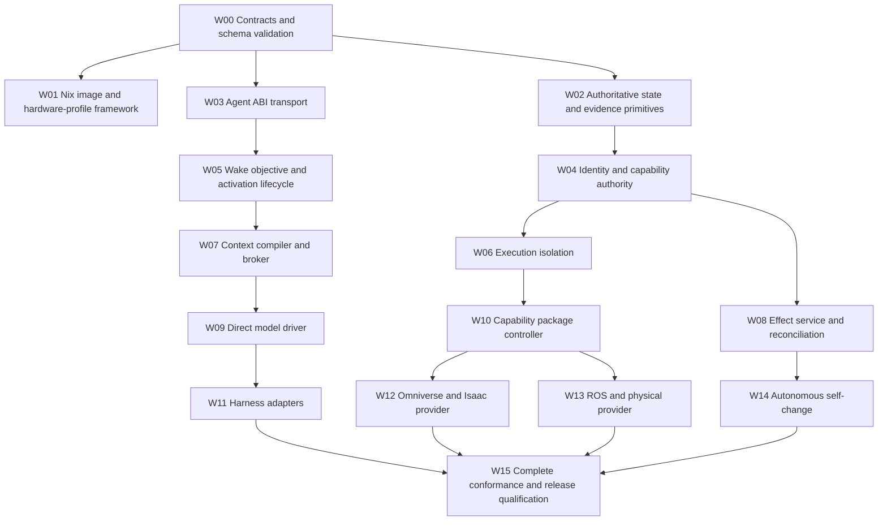

# Habitat OS — Codex Build Specification

Version: 1.1.0  
Status: Implementation-ready execution contract  
Date: 2026-08-29  
Governing package: `Habitat-OS-Architecture-Contracts-v1.1`

## 1. Instruction to Codex

Build Habitat OS as the bootable, agent-centric Linux operating system defined by the governing package. Treat that package as normative. This document selects the reference implementation, repository layout, execution order, commands, and acceptance evidence; it does not replace the architecture or weaken its invariants.

Codex SHALL:

1. read the complete governing package before changing code;
2. implement work packets in the order and dependency graph below;
3. make the smallest production-quality change that closes the current packet;
4. run the packet's required checks and retain evidence;
5. report failures or missing prerequisites honestly rather than substituting mocks, stubs, or claims based only on compilation;
6. stop at a packet boundary unless the invoking task explicitly authorizes the next packet.

The first execution target is **W00 and W01**: create the repository, lock the toolchain, validate the contracts, build the reference QEMU image, boot it without a login, expose its immutable generation identity, and prove automatic rollback from an unconfirmed candidate. This is a production foundation, not a claim that the complete Habitat runtime already exists.

## 2. Source of truth and conflict handling

Authority descends in this order:

1. `14-DECISION-REGISTER.md` and the governing invariants in `README.md`;
2. numbered normative architecture and contract documents;
3. JSON Schemas and Protobuf contracts;
4. this build specification;
5. implementation code, tests, and comments.

Within the delivered bundle, machine-readable registries reside under `Habitat-OS-Architecture-Contracts-v1.1/contracts/`. Codex SHALL copy them unchanged into the implementation repository's root `contracts/` directory before W00 generation or validation.

If two higher-authority artifacts conflict, Codex SHALL stop the affected work, record a blocker in `docs/implementation/blockers.md`, and identify the exact requirement IDs. Codex SHALL NOT silently resolve product policy in code.

## 3. End state

The completed repository produces signed, reproducible Habitat OS generations whose native operational principals are durable agents. Linux supplies hardware mechanisms; Habitat owns agent identity, objectives, activations, context, capabilities, effects, evidence, package activation, recovery, and operator surfaces.

The release is complete only when:

- all W00–W15 packet gates pass;
- every critical requirement has implementation, enforcement, evidence, and acceptance links;
- the integrated autonomous-work scenario in `12-VERIFICATION-MATRIX.md` passes after power interruption;
- the reference QEMU profile proves defective-generation rollback;
- no blocker is open and no required gate is reported as skipped.

## 4. Explicit exclusions

Codex SHALL NOT:

- make Habitat an application, container, desktop session, or service bundle hosted by Ubuntu;
- create a custom kernel or replace Linux hardware support;
- use a harness transcript, prompt, vector index, event stream, or telemetry backend as authoritative state;
- give models, generated code, or ordinary activations provider credentials or direct access around the effect boundary;
- encode domain reasoning into a universal behavior tree or mandatory planner/critic loop;
- add routine human approvals where a bounded capability grant is sufficient;
- claim a provider, hardware profile, isolation mode, or safety property is supported without its live qualification evidence;
- introduce temporary identity, authority, state, effect, or package models that require later architectural replacement.

## 5. Resolved reference implementation decisions

These decisions are approved by DEC-016 through DEC-021 in `14-DECISION-REGISTER.md` and bind the `qemu-x86_64-conformance` reference profile or reference release scope stated there. Other profiles may select qualified alternatives while preserving the Habitat ABI and all governing invariants.

| Concern | Selected implementation |
|---|---|
| System construction | Nix flake locked to the `nixos-26.05` release branch and its resolved commit |
| Kernel | Linux 6.12 LTS for the reference QEMU profile; exact derivation and digest recorded in the generation manifest |
| Init and supervision | systemd as a low-level service supervisor; it is not the semantic authority plane |
| Boot | UEFI, GPT, systemd-boot boot counting, one-shot candidate boot, automatic previous-generation fallback |
| Privileged services | Rust workspace; Rust toolchain comes from the locked Nix input and is recorded in build provenance |
| Internal ABI | Protobuf/gRPC over Unix-domain sockets; schema versioning is mandatory |
| Local workload authentication | Unix peer credentials plus Habitat-issued, short-lived activation identity; remote transport requires mutually authenticated TLS |
| Operational truth | PostgreSQL 17, local in the reference profile, with migrations owned by the repository |
| Durable work delivery | Transactional PostgreSQL tables with leases and `SKIP LOCKED`; no second workflow authority |
| Large evidence | S3-compatible MinIO in the single-node reference profile, content addressed by SHA-256, versioned and separated from evaluated workspaces |
| OCI | containerd with immutable digest references |
| WASI | Wasmtime with explicit preopens, clocks, networking, and resource limits |
| Reference microVM | Firecracker where KVM is available; unsupported environments declare the feature absent and cannot pass its qualification gate |
| Isolation | cgroups v2, namespaces, seccomp, Landlock, read-only Nix closures, per-activation workspaces, and explicit network/device policy |
| Observability | OpenTelemetry SDK/collector, structured journald events, Prometheus metrics, and protected evidence references |
| Model drivers | Provider-neutral core; first direct drivers are OpenAI Responses and Anthropic Messages, with credentials held only by the provider service |
| Harness adapters | Codex CLI and Claude Code are optional cognition backends and never own durable agent state |
| QEMU operator access | No desktop, display manager, automatic shell login, or SSH by default; recovery access uses a separately authorized recovery profile |

All package and tool versions SHALL be resolved into `flake.lock` and the Cargo lockfile. Floating Git revisions, mutable container tags, and unpinned downloads are prohibited.

## 6. Repository contract

Codex SHALL create this repository shape. A path may be added only when it has a defined owner and release purpose.

```text
habitat-os/
├── AGENTS.md
├── CODEX-BUILD-SPEC.md
├── README.md
├── flake.nix
├── flake.lock
├── Cargo.toml
├── Cargo.lock
├── rust-toolchain.toml
├── contracts/
│   ├── architecture/
│   ├── proto/
│   ├── schemas/
│   └── generated/
├── crates/
│   ├── habitat-types/
│   ├── habitat-identity/
│   ├── habitat-state/
│   ├── habitat-abi/
│   ├── habitat-bootstrap/
│   ├── habitat-authority/
│   ├── habitat-scheduler/
│   ├── habitat-context/
│   ├── habitat-effects/
│   ├── habitat-execution/
│   ├── habitat-packages/
│   ├── habitat-generations/
│   ├── habitat-models/
│   └── habitat-evidence/
├── migrations/
├── nix/
│   ├── lib/
│   ├── modules/
│   ├── images/
│   ├── profiles/
│   │   └── qemu-x86_64-conformance.nix
│   ├── packages/
│   └── tests/
├── packages/
│   ├── built-in/
│   └── schemas/
├── policy/
├── tests/
│   ├── contract/
│   ├── integration/
│   ├── adversarial/
│   ├── fault-injection/
│   └── system/
├── tools/
├── docs/
│   ├── adr/
│   ├── implementation/
│   ├── operations/
│   └── generated/
└── evidence/
    └── work-packets/
```

`contracts/architecture` SHALL contain an unchanged copy of the governing Markdown files. `contracts/proto` and `contracts/schemas` SHALL be the code-generation sources. Generated files SHALL include a source digest and SHALL fail CI when stale.

## 7. Flake outputs and operator commands

The flake SHALL expose these stable outputs on `x86_64-linux`:

| Output | Purpose |
|---|---|
| `packages.habitat-qemu` | Persistent UEFI QEMU disk image for the conformance profile |
| `packages.habitat-raw` | Raw deployable disk image |
| `packages.habitat-installer` | Offline installer image containing a verified generation |
| `packages.habitat-recovery` | Independently bootable recovery image |
| `apps.run-habitat-qemu` | Launch a disposable copy with serial evidence output |
| `apps.test-boot` | Automated boot and pre-operational-state assertion |
| `apps.test-rollback` | Install an unconfirmed candidate and prove fallback |
| `apps.qualify` | Run every gate applicable to the selected profile |
| `devShells.default` | Locked developer shell containing Nix, Rust, Protobuf, database, VM, test, SBOM, and lint tools |

The following commands are the public build interface and SHALL remain valid:

```bash
nix flake check --show-trace
nix build .#packages.x86_64-linux.habitat-qemu
nix run .#apps.x86_64-linux.run-habitat-qemu
nix run .#apps.x86_64-linux.test-boot
nix run .#apps.x86_64-linux.test-rollback
nix build .#packages.x86_64-linux.habitat-raw
nix build .#packages.x86_64-linux.habitat-installer
nix build .#packages.x86_64-linux.habitat-recovery
nix run .#apps.x86_64-linux.qualify
```

No command may depend on an undeclared host package. Builds SHALL work from a clean checkout with Nix flakes enabled. Network access is permitted only while resolving a deliberate lockfile update; normal builds and tests use locked inputs.

## 8. Boot and disk contract

The reference image SHALL use GPT with:

1. an EFI System Partition containing signed boot artifacts;
2. an immutable Nix system partition/closure set;
3. a persistent Habitat state partition mounted at `/var/lib/habitat`;
4. capability-owned persistent data under `/srv/habitat`;
5. disposable activation storage with quotas;
6. a recovery generation not writable by ordinary agent or activation principals.

Every boot SHALL emit structured serial records containing at least:

- machine identity;
- system generation ID and closure digest;
- hardware profile ID;
- boot attempt ID;
- previous confirmed generation ID;
- bootstrap phase and health result;
- confirmation, rollback, quarantine, or recovery decision.

No secret, token, prompt content, provider payload, or private evidence body may appear in boot logs.

A candidate generation SHALL be a one-shot, boot-counted entry. Until `habitat-bootstrap` proves every confirmation prerequisite, it remains `ACTIVE_UNCONFIRMED`. Failure, crash, or timeout SHALL cause firmware/bootloader selection of the previous confirmed generation without human action. Confirmation SHALL bless only the exact booted generation and attempt ID.

During W01, services not yet implemented SHALL NOT be represented as healthy stubs. The image SHALL enter an explicit `PRE_OPERATIONAL` state and intentionally remain unconfirmed when a final-runtime prerequisite is absent. W01 passes by proving build, boot identity, honest pre-operational state, and rollback—not by claiming ARC-001 or GEN-004 prematurely.

## 9. Service and process boundary

Each privileged Habitat service SHALL:

- run under a dedicated non-login service principal;
- receive only required filesystem paths, devices, sockets, and network destinations;
- use systemd hardening and explicit capability bounding;
- expose a versioned health contract that distinguishes alive, ready, degraded, failed, and recovery-required;
- use structured errors from a shared `habitat-types` crate;
- support graceful shutdown and crash-safe restart;
- refuse unknown major ABI or schema versions;
- emit OpenTelemetry correlation identifiers and evidence references without leaking secrets.

Generated code and model-driven workloads SHALL never execute in a privileged service process. All external effects SHALL pass through `habitat-effects` and an admitted capability provider.

## 10. Authoritative state contract

PostgreSQL SHALL own durable records for machines, principals, agents, objectives, wakes, activations, grants, revocations, context bundles, capability activation sets, effects, effect attempts, observations, evidence references, packages, and system generations.

Each table SHALL include stable identity, schema version, creation time, update/version semantics, provenance, and retention classification as applicable. State transitions SHALL be enforced transactionally, not inferred from logs. Migrations SHALL be monotonic, interruption-safe, checksum recorded, and tested against the previous supported generation.

Large evidence bodies SHALL be written to content-addressed object storage before their immutable digest reference is committed. An evaluator's workspace SHALL not have write authority to the protected evidence namespace used to judge it.

No application-level distributed transaction is assumed. Cross-system operations use reservation, durable attempts, observations, and reconciliation as defined in `05-EFFECTS.md`.

## 11. Identity and authority enforcement

The machine receives an Ed25519 identity at first boot. On TPM-capable profiles the private key SHALL be TPM-bound. The QEMU release gate SHALL use swtpm-backed identity; a software-protected mode MAY exist for local development but SHALL be labeled non-production and SHALL NOT satisfy identity or measured-boot qualification.

Every activation receives a short-lived principal bound to:

- durable agent ID;
- objective and activation IDs;
- system generation ID;
- capability activation set ID;
- isolation profile;
- issue and expiry times;
- revocation epoch.

The authority service SHALL evaluate operation, target, constraints, expiry, delegation chain, generation bounds, quotas, and current revocation state at every invocation. Linux and runtime isolation SHALL independently prevent direct access to provider sockets, credentials, devices, and networks. Prompt instructions are never an enforcement mechanism.

## 12. Agent activation loop

The implemented loop SHALL preserve the native flow:

1. commit a durable wake;
2. lease it transactionally to one eligible activation while allowing harmless redelivery;
3. compile a versioned, provenance-bearing context bundle;
4. invoke a direct model driver or optional harness inside the declared isolation profile;
5. accept only a schema-valid typed disposition;
6. satisfy semantic context requests through the broker;
7. mediate reads through capabilities and consequential writes through durable effects;
8. commit observations and results before acknowledging the wake;
9. verify the objective's independent completion contract;
10. schedule continuation, completion, suspension, or recovery.

Reasoning may be open-ended. Deterministic state transitions, authorization, effect admission, retry classification, quotas, and safety bounds SHALL not be delegated to the model.

## 13. Context demand-loading

The context compiler SHALL construct the smallest sufficient activation context from authoritative state, evidence, objectives, policy, applicable skills, and source provenance. It SHALL not replay an indefinitely growing transcript.

An activation may raise a semantic context request without knowing a document or skill identifier. The broker SHALL classify the missing need, retrieve candidates, test applicability and freshness, preserve contradictions, and return either a new versioned bundle or an explicit unsatisfied result. Repeated failure, low evidence coverage, contradiction, and uncertainty MAY add metacognitive hints to inspect causes, root causes, or applicable procedures. They SHALL not force a universal reasoning script when it is unnecessary.

Untrusted retrieved content SHALL be marked as data and SHALL not acquire authority by appearing in model context.

## 14. Effect execution

Consequential proposals SHALL be normalized into a durable effect instance before provider dispatch. The tuple that defines semantic uniqueness SHALL be declared per capability and enforced with a database uniqueness constraint.

An effect moves through admission, reservation, dispatch, observation, and reconciliation. A disconnect after dispatch creates `OUTCOME_UNKNOWN`; it SHALL never trigger a blind retry. Reconciliation uses provider idempotency keys, independent observation, or a declared compensation plan. Compensation is a new effect with its own truthful history.

Provider credentials remain inside the provider process or secret service. Network policy SHALL make the provider endpoint unreachable from ordinary activations.

## 15. Package and execution model

Every capability package SHALL be signed and content addressed, declare its runtime kind, schemas, operations, consequence classes, isolation requirements, resource limits, dependencies, health semantics, migrations, evidence, and revocation behavior.

Activations bind to an immutable capability activation set for their lifetime. Package replacement creates a new set; existing work drains or explicitly migrates and never silently rebinds.

Supported runtime kinds are native service, WASI, OCI, microVM, remote provider, and physical provider. A runtime is advertised only when the active hardware profile can enforce its declared guarantees.

## 16. Work-packet execution graph

Use the W00–W15 definitions in `13-IMPLEMENTATION-WORK-GRAPH.md`. `contracts/work-packets.yaml` is the sole source of truth for dependency strength and exit evidence. This section is generated by `tests/generate_work_graph.py`; direct edits are prohibited.

<!-- BEGIN GENERATED WORK GRAPH -->


The diagram shows `cannot_begin` edges. Integration and pass dependencies are explicit below.

| Packet | Cannot begin until | Cannot integrate until | Cannot pass until |
|---|---|---|---|
| `W00` | — | — | — |
| `W01` | `W00` | — | `W00` |
| `W02` | `W00` | — | `W00` |
| `W03` | `W00` | — | `W00` |
| `W04` | `W02` | `W03` | `W02`, `W03` |
| `W05` | `W03` | `W02`, `W04` | `W02`, `W03`, `W04` |
| `W06` | `W04` | `W01`, `W03` | `W01`, `W03`, `W04` |
| `W07` | `W05` | `W03`, `W06` | `W03`, `W05`, `W06` |
| `W08` | `W04` | `W02`, `W03`, `W06` | `W02`, `W03`, `W04`, `W06` |
| `W09` | `W07` | `W03`, `W05`, `W06` | `W03`, `W05`, `W06`, `W07` |
| `W10` | `W06` | `W03`, `W04`, `W08` | `W03`, `W04`, `W06`, `W08` |
| `W11` | `W09` | `W05`, `W10` | `W05`, `W09`, `W10` |
| `W12` | `W10` | `W01`, `W06`, `W08` | `W01`, `W06`, `W08`, `W10` |
| `W13` | `W10` | `W01`, `W06`, `W08` | `W01`, `W06`, `W08`, `W10` |
| `W14` | `W08` | `W01`, `W04`, `W10` | `W01`, `W04`, `W08`, `W10` |
| `W15` | `W11`, `W12`, `W13`, `W14` | `W01`, `W02`, `W03`, `W04`, `W05`, `W06`, `W07`, `W08`, `W09`, `W10` | `W00`, `W01`, `W02`, `W03`, `W04`, `W05`, `W06`, `W07`, `W08`, `W09`, `W10`, `W11`, `W12`, `W13`, `W14` |

Source SHA-256: `21026bbcfc8003678e8b94be453b05af56cfb6a0bc48175f89e74bb16de54f63`
<!-- END GENERATED WORK GRAPH -->

Final generation confirmation additionally depends on W02, W04, W06, and W08 because GEN-004 requires coherent state, evidence, authority, isolation, and effect reconciliation.

## 17. Packet protocol

Before editing a packet, Codex SHALL create or update `docs/implementation/Wxx.md` with:

- governing requirement IDs;
- components and files affected;
- migrations and compatibility impact;
- authority and failure boundaries;
- exact tests and evidence outputs;
- rollback/decommission behavior;
- unresolved blockers.

For each packet, Codex SHALL follow this sequence:

1. validate governing contracts;
2. inspect the current repository and preserve unrelated user changes;
3. implement contracts and generated bindings before consumers;
4. implement the nominal path and explicit degraded/failure states;
5. add unit, integration, negative, fault-injection, recovery, and compatibility tests required by the packet;
6. run the narrow tests, then the complete regression suite;
7. generate SBOM, provenance, and packet evidence;
8. write `evidence/work-packets/Wxx/result.json`;
9. update traceability without changing requirement meaning;
10. stop and report the packet result.

The packet result schema SHALL contain packet ID, source commit, source-lock digest, system-generation ID when applicable, commands executed, test counts, evidence digests, requirement coverage, qualified profiles, skipped/not-applicable gates with reasons, blockers, and final status `passed`, `failed`, or `blocked`.

## 18. W00 acceptance

W00 SHALL deliver:

- exact copies of governing contracts;
- JSON Schema validation against the declared metaschema;
- Protobuf formatting, linting, compilation, descriptor output, and breaking-change check;
- generated Rust bindings reproducible from sources;
- requirement/reference validation extended to this build specification;
- a traceability linter that rejects critical requirements without test/evidence mappings;
- a locked Nix and Cargo toolchain;
- CI jobs using only public flake outputs.

W00 passes only when `nix flake check --show-trace` succeeds from a clean checkout and regeneration produces no diff.

## 19. W01 acceptance

W01 SHALL deliver the QEMU profile, disk/image builders, recovery image, generation manifest, boot-counted activation, bootstrap service, serial evidence protocol, and automated boot/rollback tests.

`test-boot` SHALL:

1. launch the built image under QEMU/UEFI;
2. observe machine and generation identity;
3. observe bootstrap enter the truthful current state without any login;
4. power-cycle the persistent disk;
5. prove identity and durable generation history survive;
6. fail on emergency shell, interactive prompt, secret leakage, or unexpected writable path.

`test-rollback` SHALL:

1. boot and retain a bootloader-qualified baseline entry without falsely recording final Habitat `CONFIRMED` state;
2. install a deliberately non-confirming candidate through the generation controller;
3. boot the candidate and record its attempt;
4. withhold confirmation or terminate it before confirmation;
5. reboot and prove selection of the exact baseline/recovery entry chosen before the candidate;
6. prove operational state was not rolled back with software;
7. retain candidate, failure, and rollback evidence.

W01 passes only with live QEMU evidence. This test qualifies the boot-counting and fallback mechanism; W15 SHALL repeat V-ROLLBACK against a genuinely `CONFIRMED` complete Habitat generation. Evaluating a Nix derivation, finding a service process, or matching a log string without state verification is insufficient.

## 20. W02–W15 exit rule

For W02–W15, the exit evidence in `13-IMPLEMENTATION-WORK-GRAPH.md` is mandatory. Each packet SHALL also pass every applicable gate in `12-VERIFICATION-MATRIX.md`, including its negative and fault-injection cases. Mocks may exercise unit boundaries but SHALL NOT satisfy live provider, isolation, boot, rollback, recovery, effect, or physical acceptance gates.

A hardware-dependent gate may be recorded `not_applicable` only when the current profile explicitly declares the feature absent under HWP-002. It remains required before that profile or feature can be released as supported.

## 21. CI and release gates

CI SHALL contain these ordered classes:

1. formatting, lint, license, secret, and contract checks;
2. Rust unit and property tests;
3. PostgreSQL migration and crash tests;
4. service integration tests over real Unix sockets;
5. isolation and adversarial tests;
6. QEMU boot and rollback tests on a KVM-capable runner when acceleration is required;
7. reproducibility, closure manifest, SBOM, and vulnerability evidence;
8. full conformance scenario.

Release artifacts SHALL be built from a clean signed source revision. Candidate build, evaluation, signature, and activation authority SHALL be represented by distinct principals even when CI automates them. A release SHALL fail closed when evidence is missing, outcome is unknown without containment, a dependency is mutable, or a critical gate is skipped.

## 22. Security and supply chain

Codex SHALL configure:

- Nix and Cargo lock enforcement;
- source and dependency license inventory;
- SBOM generation for OS closure and Rust binaries;
- vulnerability scanning with recorded database version;
- secret scanning;
- artifact signing and verification hooks;
- read-only source and Nix closures at runtime;
- systemd sandboxing for every service;
- default-deny activation egress and device access;
- log and evidence redaction tests;
- dependency update procedure that rebuilds and requalifies affected profiles.

No real provider credential, signing root, recovery key, or production secret may be committed to the repository or Nix store.

## 23. Testing principles

Tests SHALL assert semantic state through supported interfaces or independent evidence, not private implementation details. Time, randomness, provider responses, and crash points SHALL be controllable in tests. Property tests SHALL cover capability attenuation, effect idempotency, state-machine transition legality, and context provenance preservation.

Every consequential boundary SHALL have a test that would succeed improperly if the boundary were removed. Fault injection SHALL cover the points listed in `12-VERIFICATION-MATRIX.md`. Flaky tests are release failures; they may not be ignored or retried until green without retaining the failed evidence.

## 24. Coding constraints

- Deny unsafe Rust in privileged crates unless a reviewed module documents the unavoidable boundary and dedicated tests.
- Treat compiler warnings, Clippy warnings, schema warnings, and Protobuf lint warnings as errors.
- Use typed IDs and enums for principals, states, consequence classes, and versions; do not pass security identities as unvalidated strings.
- Use UTC timestamps plus monotonic durations for deadlines; never infer ordering solely from wall-clock time.
- Make commands idempotent where the contract permits and require explicit idempotency keys for effects.
- Bound queues, payloads, context bundles, execution time, memory, CPU, storage, and retries.
- Redact secrets at construction, not as a best-effort logging filter.
- Preserve error cause, consequence, current state, safe next action, and correlation identity.
- Document every public ABI and migration.

## 25. Definition of done and reporting

Codex may report a packet **passed** only when implementation, automated tests, live evidence, documentation, traceability, and rollback behavior are present and the complete regression suite passes.

At the end of each invocation, Codex SHALL report:

- packet attempted and status;
- files and contracts changed;
- build/test commands and results;
- artifact paths and cryptographic digests;
- live behavior actually observed;
- gates not run and the precise reason;
- residual risks or blockers;
- the next dependency-unblocked packet.

Use `blocked` when credentials, hardware, authority, network access, or an unresolved governing decision prevents valid completion. Do not replace a blocked acceptance test with simulated success.

## 26. Initial Codex invocation

Use this instruction from the empty implementation repository with the governing package available locally:

> Read `CODEX-BUILD-SPEC.md` and every file under `contracts/architecture`, `contracts/proto`, and `contracts/schemas`. Implement W00 and W01 exactly. Do not begin W02. Build the QEMU image, execute the live boot and defective-generation rollback tests, retain evidence, and stop with the packet report defined in section 25. If the environment cannot run Nix, UEFI QEMU, or the required virtualization path, finish every valid non-live deliverable, mark the affected gate blocked, and do not claim W01 passed.

## 27. Normative build requirements

**BLD-001 — Faithful implementation.** Code SHALL implement the governing contracts without introducing a competing identity, authority, state, context, effect, package, generation, or evidence model.

**BLD-002 — Reproducible public interface.** A clean checkout with locked inputs SHALL expose and successfully execute the flake outputs and commands defined in section 7 for every implemented packet.

**BLD-003 — Honest readiness.** Missing services, unavailable hardware, failed tests, and unqualified features SHALL produce explicit pre-operational, degraded, failed, absent, or blocked states and SHALL NOT be represented by healthy stubs.

**BLD-004 — Packet evidence.** A work packet SHALL NOT be marked passed until its required live behavior, negative tests, recovery tests, evidence digests, and requirement mappings exist.

**BLD-005 — No authority bypass.** Models, harnesses, generated code, package workloads, and ordinary activations SHALL be unable to reach provider credentials, devices, privileged sockets, or external effect endpoints except through admitted Habitat capabilities.

**BLD-006 — Durable recovery.** Process, service, model, provider, and host interruption SHALL preserve authoritative histories and SHALL restore invariants before work is resumed or a generation is confirmed.

**BLD-007 — Independent qualification.** The principal or activation being evaluated SHALL NOT control its acceptance criteria, evaluator configuration, protected evidence, release signature, or activation authority.

**BLD-008 — Profile truthfulness.** A hardware profile SHALL advertise only features whose enforcement and recovery behavior have passed live qualification on that profile.

**BLD-009 — No implicit policy.** When a consequential decision is absent or contradictory in the governing package, Codex SHALL record a blocker rather than inventing policy in code.

**BLD-010 — Production continuity.** Every merged implementation SHALL be part of the final architecture or a final test/evidence mechanism; disposable product paths that require later replacement are prohibited.

## 28. Release condition

This specification is ready for Codex execution. W00/W01 may begin immediately. A full Habitat OS release remains gated by W02–W15 and all governing verification gates; the first image is a truthful pre-operational conformance foundation until those dependencies are satisfied.
