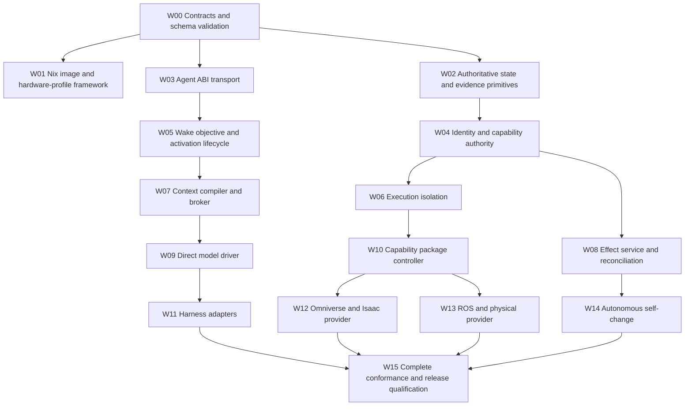

# Implementation Work Graph

## 1. Governing principle

Work packets implement final contracts. No packet may introduce a temporary identity, authority, effect or state model requiring later replacement.

## 2. Canonical dependency graph

`contracts/work-packets.yaml` is the sole source of truth. This section is generated by `tests/generate_work_graph.py`; direct edits are prohibited.

<!-- BEGIN GENERATED WORK GRAPH -->

The diagram shows `cannot_begin` edges. Integration and pass dependencies are explicit below.

| Packet | Cannot begin until | Cannot integrate until | Cannot pass until |
|---|---|---|---|
| `W00` | — | — | — |
| `W01` | `W00` | — | `W00` |
| `W02` | `W00` | — | `W00` |
| `W03` | `W00` | — | `W00` |
| `W04` | `W02` | `W03` | `W02`, `W03` |
| `W05` | `W03` | `W02`, `W04` | `W02`, `W03`, `W04` |
| `W06` | `W04` | `W01`, `W03` | `W01`, `W03`, `W04` |
| `W07` | `W05` | `W03`, `W06` | `W03`, `W05`, `W06` |
| `W08` | `W04` | `W02`, `W03`, `W06` | `W02`, `W03`, `W04`, `W06` |
| `W09` | `W07` | `W03`, `W05`, `W06` | `W03`, `W05`, `W06`, `W07` |
| `W10` | `W06` | `W03`, `W04`, `W08` | `W03`, `W04`, `W06`, `W08` |
| `W11` | `W09` | `W05`, `W10` | `W05`, `W09`, `W10` |
| `W12` | `W10` | `W01`, `W06`, `W08` | `W01`, `W06`, `W08`, `W10` |
| `W13` | `W10` | `W01`, `W06`, `W08` | `W01`, `W06`, `W08`, `W10` |
| `W14` | `W08` | `W01`, `W04`, `W10` | `W01`, `W04`, `W08`, `W10` |
| `W15` | `W11`, `W12`, `W13`, `W14` | `W01`, `W02`, `W03`, `W04`, `W05`, `W06`, `W07`, `W08`, `W09`, `W10` | `W00`, `W01`, `W02`, `W03`, `W04`, `W05`, `W06`, `W07`, `W08`, `W09`, `W10`, `W11`, `W12`, `W13`, `W14` |

Source SHA-256: `21026bbcfc8003678e8b94be453b05af56cfb6a0bc48175f89e74bb16de54f63`
<!-- END GENERATED WORK GRAPH -->

## 3. Work packets

| ID | Deliverable | Exit evidence |
|---|---|---|
| W00 | Schemas, Protobuf, state machines, validator | All references and schemas valid; semantic review closed |
| W01 | Reproducible bootable Habitat OS image | QEMU boot, generation identity, defective-boot rollback |
| W02 | Transactional state, append-only history, evidence references | Crash-injection and restore tests |
| W03 | Versioned Agent ABI server/client | Compatibility and duplicate-command tests |
| W04 | Principals, grants, delegation, revocation | Negative authorization and attenuation tests |
| W05 | Objectives, wakes, activations, leases | No lost wake under crash matrix |
| W06 | Process/WASI/OCI/microVM execution | Escape, resource and termination tests |
| W07 | Context compilation and semantic request resolution | Stale, contradictory and page-fault tests |
| W08 | Effect reservation, provider execution, reconciliation | Ambiguous outcome and compensation tests |
| W09 | Direct frontier-model activation driver | Structured disposition and provider-replacement tests |
| W10 | Signed package activation sets | Pin, drain, revoke, migration and rollback tests |
| W11 | Codex/Claude/other harness compatibility | Same-agent conformance across backends |
| W12 | GPU compatibility capsule and simulation capability | Live RTX/Isaac operation and evidence |
| W13 | ROS and physical-effect adapter | Timing, stale-command and independent-stop evidence |
| W14 | Candidate change build/evaluate/sign/activate loop | Valid autonomous promotion and defective rollback |
| W15 | System qualification | All matrix gates pass on reference profiles |

## 4. Cross-cutting requirements

Every packet includes:

- threat and failure analysis;
- schema migrations;
- telemetry and evidence;
- rollback or decommission behavior;
- resource limits;
- negative tests;
- documentation generated from governing contracts where possible.

## 5. Implementation technology baseline

- Linux LTS hardware kernels/BSPs.
- Nix for system construction and signed generations.
- Go or Rust for privileged Habitat services; language choice SHALL not weaken ABI or isolation.
- PostgreSQL for authoritative transactional state.
- Content-addressed object storage for large evidence.
- Protobuf/gRPC for internal ABI transport.
- JSON Schema for model-facing and package contracts.
- containerd, Wasmtime and KVM-based microVM execution.
- OpenTelemetry for traces and metrics.

Exact dependency versions are selected and locked during W00/W01 qualification, not invented by later work packets.

## 6. Prohibited shortcuts

- Treating a harness transcript as durable agent state.
- Calling a tool directly from model code around the effect boundary.
- Using prompts as authorization enforcement.
- Marking a provider active from process health alone.
- Retrying unknown external outcomes.
- Loading mutable image tags or unsigned native libraries.
- Storing critical evidence in the evaluated workspace.
- Requiring routine human approval where a bounded grant can be issued.
